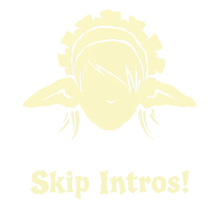

<table>
  <tr>
    <td></td>
    <td>
      <h1>Skip Intros</h1>
      <p>A <a href="https://store.steampowered.com/app/2750010">Goblin Cleanup</a> mod that skips intro videos and
        splash screens on startup.</p>
    </td>
  </tr>
</table>

[](https://thunderstore.io/c/goblincleanup/)


## Installation (Manual)
1. Install [BepInExPack for Goblin Cleanup](https://github.com/hazre/BepInExPack-GoblinCleanup).
2. Download the latest release ZIP from the [Releases](https://github.com/hazre/GoblinCleanupSkipIntros/releases) page.
3. Extract and copy `GoblinCleanupSkipIntros.dll` to `BepInEx/plugins/`.
4. Start the game.

## Development
 
Install [mise](https://mise.jdx.dev/getting-started.html) and run `mise install` to set up tools.
 
```bash
mise run build    # Build the DLL
mise run package  # Build the Thunderstore package
```
 
Run `mise tasks` to list all available tasks.


## License

This project is licensed under MIT License. See [LICENSE](LICENSE) for details.
